# Guia de Programação em Python

 

Bem-vinda(o) ao guia para os seus primeiros passos no Python! Indicamos que, para melhor estruturar seu aprendizado, siga a ordem proposta no sumário abaixo:

## 1) SUMÁRIO

1. [Instalação](./docs/installation.md)
2. [Configuração do Ambiente de Desenvolvimento](./docs/configuration.md)
3. [Comentários](./docs/comments.md)
4. [Variáveis](./docs/variables.md)
5. [Funções](./docs/functions.md)
6. [Desvios Condicionais](./docs/conditionals.md)
7. [Estruturas de Repetição](./docs/looping.md)
8. [Aplicação](./exemplo/)

## 2) ELABORAÇÃO

- [@anisiobfilho](https://github.com/anisiobfilho)
- [@edjairaguiar](https://github.com/edjairaguiar)
- [@elaynelemos](https://github.com/elaynelemos)

## 3) INTRODUÇÃO

A linguagem Python é uma linguagem de programação descrita pelas seguintes características:
<ul>
<li>Alto-nível: sua sintaxe se aproxima mais da linguagem humana e se distancia mais
da linguagem de máquina;
<li>Imperativa: as variáveis são mudadas através de comando imperativos, que
expressam ordem;
<li>Orientada a objeto;
<li>Funcional: utiliza funções matemáticas para avaliar a mudança de variáveis;
Uma das características da linguagem é a fácil leitura do seu código, que permite a escrita de códigos mais enxutos, mais simples e com menos linhas se comparado ao mesmo programa escrito em outra linguagem. É muito utilizada para processamento de textos, dados científicos, computação gráfica de páginas da web e no ramo da inteligência artificial.
</ul>

<i>[!] Curiosidade: O nome Python tem origem no grupo britânico Monty Python, criador do programa Monty Python’s Flying Circus – um programa de humor que foi ao ar pela primeira vez na televisão no ano de 1969.</i>

## 4) TIPOS EM PYTHON
A parte interessante do Python é que essa é uma linguagem de tipos dinâmicos: ou seja, a
declaração de tipo da variável não precisa ser feita. A própria linguagem é capaz de escolher
que tipo usar para cada variável, podendo alterá-lo durante a execução do programa.
Aqui, teremos quatro tipos numéricos:
<ul>
<li> Inteiro (int);
<li> Ponto flutuante (float);
<li> Booleano (bool);
<li> Complexo (complex);
</ul>

Todos esses tipos suportam as operações algébricas comuns (adição, subtração, multiplicação
e divisão) e também podem se relacionar. As figuras abaixo mostram alguns exemplos do
funcionamento de tipos em Python:

  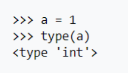
  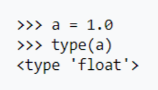
  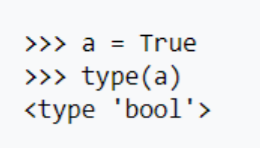
  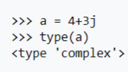

### 4.1) Tipo string
Uma string é um vetor de caracteres. Quando dizemos que uma variável tem o tipo string, é
porque nela contém um caractere, uma frase ou até mesmo um texto.
Em Python, strings podem ser escritas usando aspas simples ou aspas duplas. Ao usar aspas
simples, torna-se mais fácil incluir aspas dentro da string.

<ul>
<li> ‘Isso é uma string em Python’
<li> “Isso também é uma string em Python”
<li> ‘Ele disse “Alô?” e desligou o telefone’
<li> “Gota d’água”
</ul>

### 4.2) Caracteres especiais em strings
Caracteres especiais são alguns caracteres que tornam mais fácil a manipulação de strings. Por
exemplo:

  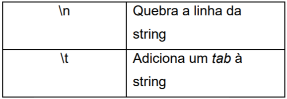

Com isso, podemos tornar nossas strings mais esteticamente bonitas e/ou organizadas.

### 4.3) Operações com strings 
Por se tratar de um vetor de caracteres, podemos muito bem manipular as strings. Para isso,
temos alguns operadores e métodos especiais. Os principais são:

<ul>
  <li> <b>Concatenação (+):</b> Une duas strings em uma só;
  <li> <b> Comprimento (len(nome_da_string)):</b> Devolve o tamanho da string que está sendo
manipulada;
  <li> <b> Repetição (*):</b> Repete o que está entre as aspas um número determinado de vezes.
  <li> <b> Indexação e slicing ([]):</b> Por se tratar de um vetor, cada caractere da string tem uma
indexação associada. Por exemplo, na string ‘Sinais’, temos 6 caracteres. A posição [0]
é a letra ‘S’, enquanto a posição [4] é a letra ‘i’.
</ul>

A tabela abaixo nos dá alguns exemplos de operações e o que é armazenado na variável:

  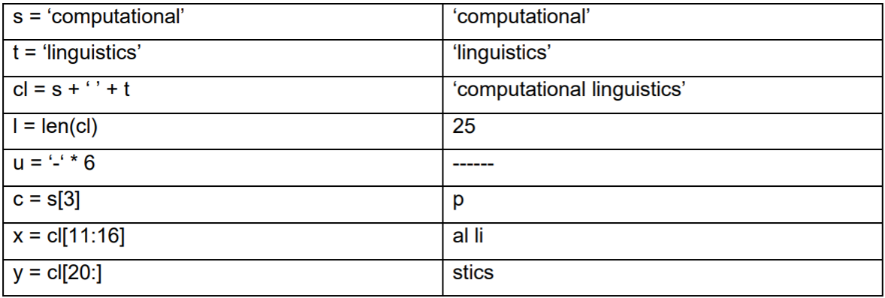

### 4.4) Métodos úteis com strings
Podemos também alterar uma string ao utilizar alguns métodos simples. Podemos, por exemplo, procurar uma sílaba, contar quantas vezes uma sílaba aparece na string e muito mais. A tabela abaixo mostra alguns exemplos de uso desses métodos.

A tabela abaixo nos dá alguns exemplos de operações e o que é armazenado na variável:

  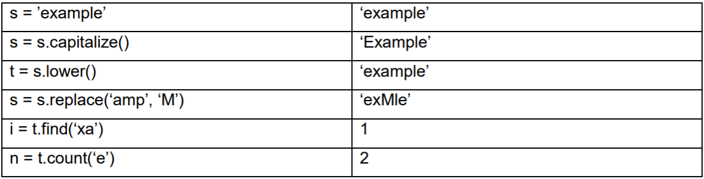

## 5) OPERADORES
Os operadores são os símbolos que atuam sobre as variáveis. Citamos:

<ul>
  <li>
    Operadores aritméticos:
    

      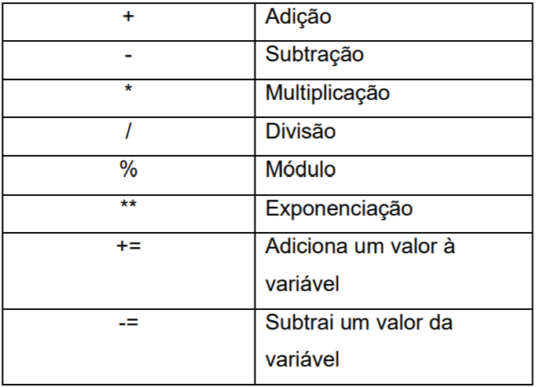
    

  </li>
  <li>
    Operadores comparativos:
    

      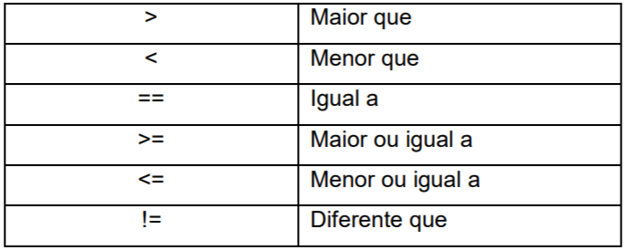
    

  </li>
  <li>Operadores lógicos; </li>
  <li>Operador de atribuição (=).</li>
</ul>

## 6) MODO INTERATIVO
Primeiramente, é possível configurar o interpretador Python para ser chamado diretamente pelo prompt de comando.

<li>Baixe o Python 3.8 <a href="https://www.python.org/downloads/">aqui</a>.</li>
<li>Você pode realizar a configuração do path através <a href="https://www.mundodoshackers.com.br/como-executar-um-codigo-python-pelo-prompt-de-comando">desse tutorial</a>.</li>
 
Ao chamar o interpretador Python diretamente pelo prompt de comando (simplesmente digitando python), você entrará no modo interativo. Esse modo nos possibilita “conversar”
diretamente com o prompt de comando, declarando variáveis, funções e tudo o que você pode fazer num programa interessante.
Podemos começar inicialmente pelo modo interativo, pois ele é muito interessante para aprendermos do zero.

  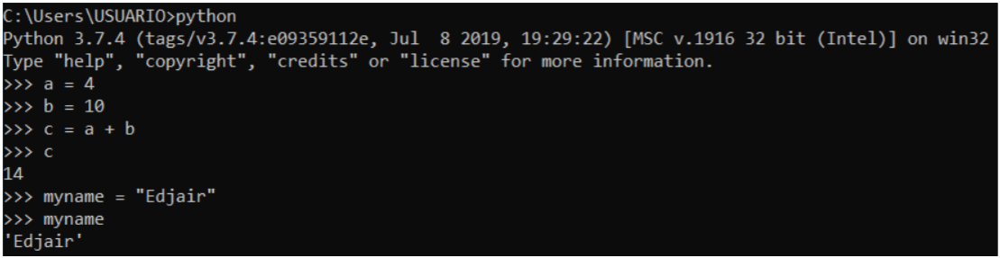

## 7) ENTRADA E SAÍDA DE DADOS
A entrada e a saída de dados referem-se à dados do mundo externo sendo expressos
digitalmente e vice-versa, respectivamente. 

### 7.1) Função print()
A grosso modo, a função print() serve para imprimir os argumentos dentro dela para a saída do programa. Ao passarmos valores ou variáveis para a função print, elas são mostradas no terminal. Um exemplo simples é mostrado na Figura abaixo:

  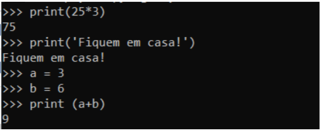

### 7.2) Função input()
A função input() faz uma pausa no programa e espera que o usuário digite algo para continuar. Para ler a entrada do usuário, a função input espera que, após digitada a entrada, o usuário tecle enter.  input então lê essa entrada. A figura abaixo mostra um exemplo simples da função input:

  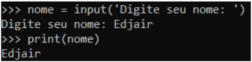

Entretanto, é importante frisar que a função input() lê a entrada como uma string. Caso queiramos que a entrada seja um número inteiro ou float, precisamos usar as funções de conversão int() e float(). É necessário que façamos isso, uma vez que as operações aritméticas só podem ser realizadas com tipos numéricos. A Figura abaixo dá um exemplo dessa conversão.

  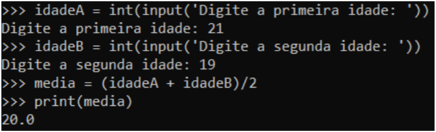

