<h2>1) MÓDULOS</h2>

Módulos são arquivos de código Python com a extensão .py, que podem ser importados por
outros módulos.
A modularização de um programa é algo bastante importante por duas razões principais:
<li> É possível reutilizar o código escrito em outras aplicações;
<li> Estando o código do programa organizado, temos maior facilidade no controle e no
entendimento da aplicação;

Quando importamos um módulo para nosso código, as declarações do arquivo importado (suas
variáveis, suas funções e etc.) ficam disponíveis para serem usadas. É mais ou menos como a
importação de uma biblioteca na linguagem .C, por exemplo.

Nós chamamos um módulo no nosso programa utilizando a linha de comando

```$ import nomeDoMódulo```

A extensão .py deve ser omitida.

<h2>2) CRIANDO E ACESSANDO ATRIBUTOS DE MÓDULOS</h2>

Cada módulo tem suas próprias declarações de variáveis, funções, classes... cada uma delas carrega com si seu nome. Podemos acessar as variáveis e funções do módulo no nosso programa. Para isso, utilizamos a notação

```$ nomeDoMódulo.nomeDaFuncao```

EXEMPLO: Podemos abrir o editor de texto e escrever uma função simples como na Figura 1. Salvamos o nome do arquivo como teste.py.

<div align="center">
  
  <h6>Figura 1 – Código do módulo teste.py</h6>
</div>

[!] ATENÇÃO: Salve o arquivo do módulo em uma pasta fácil de acessar, pois antes de chamar o interpretador python precisaremos acessar a pasta pelo prompt de comando. Eu salvei na pasta Documentos. Dessa forma, primeiro acessei a pasta onde salvei o arquivo e só então chamei o interpretador python, como visto na Figura 2.

<div align="center">
  
  <h6>Figura 2 – Precisamos acessar a pasta onde o arquivo foi salvo antes de chamar o python</h6>
</div>

Agora que salvamos nosso módulo, vamos chamá-lo para nosso programa, escrevendo ```import teste```. Logo em seguida, chamamos nossa função f digitando ```teste.f()```. O resultado podemos ver na Figura 3.

<div align="center">
  
  <h6>Figura 3– Chamamos a função f() através do módulo teste.py</h6>
</div>

<h2>3) MÓDULOS PADRÕES</h2>
O Python traz uma biblioteca padrão de módulos, embutidas no interpretador da linguagem. Esses módulos permitem o acesso a algumas operações que não fazem parte do núcleo da linguagem, mas estão no interpretador por eficiência.

Por exemplo: funções matemáticas não estão tradicionalmente inclusas no escopo de funções de entrada e saída da linguagem. Nesse caso, temos duas opções: implementá-las manualmente; ou importar o módulo math, que disponibiliza grande parte das funções matemáticas que conhecemos na calculadora científica.


<div align="center">
  <table>
    <tr>
    <td>math.exp(x)</td>
    <td>𝑒𝑥</td>
    </tr>
    <tr>
    <td>math.log10(x)</td>
    <td>Logaritmo do parâmetro x na base 10</td>  
    </tr>
    <tr>
    <td>math.pow(x, y)</td>
    <td>𝑥^𝑦</td>  
    </tr>
    <tr>
    <td>math.sqrt(x</td>
    <td>√𝑥</td>  
    </tr>
    <tr>
    <td>math.degrees(x)</td>
    <td>Converte x radianos para graus</td> 
    </tr>
    <tr>
    <td>math.radians(x)</td>
    <td>Converte x graus para radianos</td>
    </tr>
  </table>
  <h6>Tabela 1 – Algumas funções do módulo math</h6>
</div>

Na Figura 4 temos um exemplo da utilização do módulo math, utilizando a função ```math.sqrt()```.

<div align="center">
  
  <h6>Figura 4 – Cálculo de raiz quadrada com função math.sqrt</h6>
</div>

<h2>4) OBSERVAÇÕES</h2>
<li>O editor de texto usado é o Visual Studio Code. Entretanto é possível utilizar qualquer outro editor de texto, desde que a extensão do arquivo seja salva como .py. Outro editores de texto que podem ser usados: WordPad, Notepad++.
<li>A importação de módulos é custosa computacionalmente, portanto o Python só a realiza uma vez. Caso editemos o módulo durante a execução do nosso código e precisemos que a edição seja utilizada, podemos forçar que o módulo seja importado novamente usando o comando reload(nomeDoMódulo).
  
<h2>5) ARQUIVOS PYTHON</h2>
Embora a opção de utilizar o modo interativo seja uma boa forma de aprender e praticar a sintaxe da linguagem Python, concordemos que não é a forma mais elegante de programar e rodar nossas aplicações.

Assim como em qualquer outra linguagem, é muito mais prático que rodemos nossos programas quando já estão finalizados, em formato de arquivo. Podemos utilizar uma IDE (como usamos o DEV ou o CodeBlocks para programar em .C, por exemplo), mas sempre existe a opção de primeiramente escrever o programa completo em um editor de texto e em seguida executá-lo no prompt de comando.

Por enquanto utilizaremos a opção de executar arquivos no prompt de comando, pois os ambientes de desenvolvimento Python serão abordados mais futuramente, em um capítulo à parte. 

<h3>5.1) Executando arquivos .py</h3>
Assim como os módulos, a extensão de arquivo dos nossos códigos é .py. Vamos escrever um programa simples. Podemos abrir o editor de texto e escrever um programa para simplesmente exibir uma saudação na tela e se despedir quando o usuário digitar qualquer coisa no teclado, como na Figura 5.

<div align="center">
  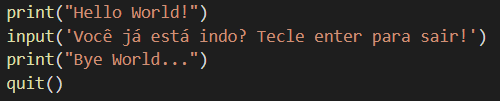
  <h6>Figura 5 – Arquivo contendo um programa simples em Python.</h6>
</div>
  
Salvamos nosso arquivo com o nome hellobye.py
  
Se você já configurou o interpretador Python seu prompt de comando, agora basta especificar o caminho do seu arquivo no prompt. Isso mesmo: não há necessidade de chamar o interpretador digitando python. Simplesmente especifique o caminho do arquivo no seu promp de comando e o seu arquivo irá executar.

[!] DICA: se você ficar com preguiça de digitar o caminho do arquivo, pode simplesmente arrastá-lo para o prompt e ele reconhecerá o caminho automaticamente
  
Quando o caminho do arquivo estiver especificado no prompt, basta teclar enter e o código será executado, sem maiores problemas.

<div align="center">
  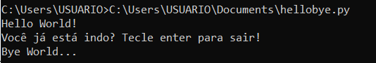
  <h6>Figura 6 – O código é executado em sua completude, sem necessidade de digitar comandos linha por linha no prompt. Muito mais elegante.</h6>
</div>
  
<h3>5.2) Importando módulos em arquivos de código</h3>
<h4>5.2.1) Módulos padrões</h4>
Para acessarmos módulos padrões de Python dentro dos nossos arquivos de código, ao invés de os chamarmos no prompt, devemos declará-los no cabeçalho do código, da mesma forma que as bibliotecas em linguagem C. Por exemplo: suponhamos o código da Figura 3, que calcula a raiz quadrada de um número que o usuário insere.

<div align="center">
  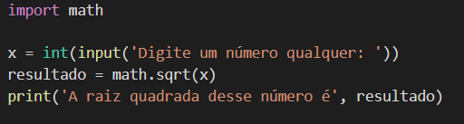
  <h6>Figura 7 – Programa para calcular raiz quadrada. Observe que o import precisou ser chamado no início do script.</h6>
</div>
  
[1] LEMBRE-SE: A função input() deve ser usada dentro da função conversão int(). Lembra da primeira aula? O input lê a entrada do usuário como uma string, mas precisamos que a entrada seja um inteiro para operar a raiz quadrada. 
[2] LEMBRE-SE: Para acessarmos as funções que existem em um módulo, precisamos especificar de qual módulo está vindo a função, no formato ```nomeDoMódulo.nomeDaFunção()```.
  
Agora podemos simplesmente chamar nosso programa no prompt de comando e executá-lo.

<div align="center">
  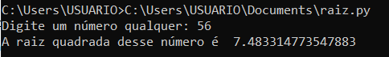
  <h6>Figura 8 – Execução do código da Figura 3</h6>
</div>
  
<h4>5.2.2) Módulos criados pelo programador</h4>
Para importamos dentro do código um módulo que nós mesmos criamos, basta que os dois arquivos estejam dentro da mesma pasta. Vamos primeiramente criar um módulo simples que define uma função que calcula o dobro de um número inserido pelo usuário. Chamaremos esse módulo de vezesdois.py.

<div align="center">
  
  <h6>Figura 9 – Módulo criado por nós, vezesdois.py</h6>
</div>

Agora escrevemos um programa que solicita ao usuário que insira um número. Importamos nosso módulo vezesdois, pedimos um número ao usuário e chamamos a função dobro de vezesdois, passando o valor do usuário como parâmetro da função.

<div align="center">
  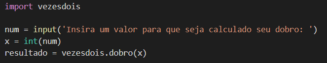
  <h6>Figura 10 – Nosso programa, que utiliza a função dobro do módulo vezesdois</h6>
</div>
  
Salvamos nosso programa como boraver.py, na mesma pasta que nosso módulo.

<div align="center">
  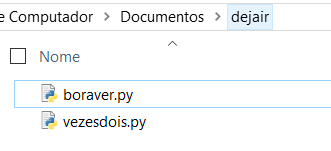
  <h6>Figura 11 – Os arquivos devem estar na mesma pasta</h6>
</div>
  
Executamos agora nosso programa boraver.py normalmente no prompt de comando.

<div align="center">
  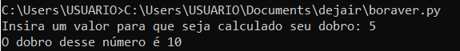
  <h6>Figura 12 – Executando o código que criamos, que chama o módulo que criamos. Dá muito trabalho ser um programador tão autossuficiente...</h6>
</div>

<h2>6) LISTAS</h2>
A gente aprende no curso de Computação que a definição de lista é uma estrutura de dados composta por itens organizados de forma linear, na qual cada um pode ser acessado a partir de um índice, começando do zero, onde cada índice representa sua posição na lista... etc.
  
O que não te contam nas disciplinas regulares do curso (ou contam, muito superficialmente) é que, diferentemente da linguagem C, por exemplo, as listas em Python não-obrigatoriamente armazenam somente objetos do mesmo tipo. Isso significa que podemos armazenar simultaneamente strings, floats, inteiros... simplificando: em Python, nossas listas podem armazenar basicamente qualquer coisa. Inclusive outras listas.
  
<h3>6.1) Representação</h3>

Nossa lista em Python vai ser representada como uma sequência de objetos separados por vírgula, dentro de colchetes. Assim, uma lista vazia, por exemplo, pode ser definida pelos colchetes vazios. A Tabela 1 mostra uma listagem de algumas possibilidades de criação de listas. Na primeira coluna temos a declaração da lista e na segunda coluna temos o que é armazenado nessa declaração.

<div align='center'>
  <table>
    <tr>
      <td>univasf = []</td>
      <td> </td>
    </tr>
    <tr>
      <td>univasf = [‘lab’, ‘ru’, 123, 111]</td>
      <td>lab, ru, 123, 111</td>
    </tr>
    <tr>
      <td>nova_uni = [‘tristeza’, univasf]</td>
      <td>tristeza, [lab, ru, 123, 111]</td>
    </tr>
  </table>
  <h6>Tabela 1 – Possibilidades de listas em Python</h6>
</div>

<h3>6.2) OPERADORES</h3>
<li>Acesso por índices: Uma lista é armazenada por índices, começando a partir do zero. Portanto, podemos acessar os objetos de nossa lista através dos seus índices. Por exemplo, a lista chamada univasf da Tabela 1 contém quatro elementos, cujos índices variam de zero a três. Dessa forma, podemos acessar cada um dos objetos através dos seus índices.
  <div align='center'>
  <table>
    <tr>
      <td>univasf[0]</td>
      <td>lab</td>
    </tr>
    <tr>
      <td>univasf[1]</td>
      <td>ru</td>
    </tr>
    <tr>
      <td>univasf[2]</td>
      <td>123</td>
    </tr>
    <tr>
      <td>univasf[3]</td>
      <td>111</td>
    </tr>
  </table>
</div>
  
<li>Comprimento: O comprimento de uma lista é devolvido através da função len(). Por exemplo, se chamarmos a função len() passando como parâmetro nossa lista univasf, será nos devolvido o tamanho quatro. Se passarmos como parâmetro a nova_uni, obteremos o tamanho dois, pois univasf é um único objeto dentro da lista nova_uni.
  <div align='center'>
  <table>
    <tr>
      <td>len(univasf)</td>
      <td>4</td>
    </tr>
    <tr>
      <td>len(nova_lista)</td>
      <td>2</td>
    </tr>
  </table>
</div>
  
<li>Concatenação e Multiplicação: Podemos concatenar listas usando a adição e multiplicar listas por um inteiro, que vai gerar várias cópias dos seus itens.
  <div align='center'>
  <table>
    <tr>
      <td>univasf+nova_uni</td>
      <td>ab, ru, 123, 111, tristeza, [lab, ru, 123, 111]</td>
    </tr>
    <tr>
      <td>lista*3</td>
      <td>ab, ru, 123, 111, lab, ru, 123, 111, lab, ru, 123, 111</td>
    </tr>
  </table>
</div>
  
<li>Verificação de itens: Outra funcionalidade interessante é que podemos procurar um objeto específico em uma lista. Usaremos o operador in, que deve ser usado da seguinte forma:
‘nomeDoObjeto’ in nomeDaLista
Esse operador vai retornar um valor booleano (True ou False), que obviamente vai indicar se o objeto está ou não contido na lista.
  <div align='center'>
  <table>
    <tr>
      <td>ru’ in univasf</td>
      <td>True</td>
    </tr>
    <tr>
      <td>‘lolzinho’ in univasf</td>
      <td>False</td>
    </tr>
  </table>
</div>
  
<li>Mínimo, máximos e somatório: Caso declaremos uma lista numérica, podemos usar as funções min(), max() e sum(), que devolvem, respectivamente, o menor valor, o maior valor e a soma dos elementos da lista. Por exemplo, declaramos uma lista chamada números:
numeros = [14.55, 67, 89.88, 10, 21.5]
Poderemos utilizar as funções descritas, que nos retornarão:
<div align='center'>
  <table>
    <tr>
      <td>min(numeros)</td>
      <td>10</td>
    </tr>
    <tr>
      <td>max(numeros)</td>
      <td>89.88</td>
    </tr>
    <tr>
      <td>sum(numeros)</td>
      <td>202.93</td>
    </tr>
  </table>
</div>
  
<h3>6.2) Métodos</h3>
A diferença entre uma operação e um método é que a operação nos retornam um resultado, enquanto o método efetua alguma alteração na estrutura da lista. Os métodos são utilizados com a seguinte sintaxe:
  
```nomeDaLista.método(parâmetro)```
  
Vejamos abaixo alguns exemplos de métodos.

<li>append(objeto): Caso declaremos uma lista chamada para_ler:
<div align='center'><table><tr><td>para_ler = [‘1984’, ‘Admirável Mundo Novo’, ‘A Revolução dos Bichos’, ‘Fahrenheit 451’]</td></tr></table></div>

Podemos adicionar um novo elemento no final dessa lista usando o método append e passando qual objeto queremos acrescentar. Teremos:
<div align='center'>
  <table>
    <tr>
      <td>para_ler.append(‘Laranja Mecânica’)</td>
      <td> </td>
    </tr>
    <tr>
      <td>para_ler</td>
      <td>[‘1984’, ‘Admirável Mundo Novo’, ‘A Revolução dos Bichos’, ‘Fahrenheit 451’, ‘Laranja Mecânica’]</td>
    </tr>
  </table>
</div>

<li>insert(índice, objeto): Enquanto o método append adiciona um objeto apenas no final da lista, o insert permite adicionar um novo objeto em qualquer índice que escolhermos.
<div align='center'>
  <table>
    <tr>
      <td>para_ler.insert(0, ‘A Guimba’)</td>
      <td> </td>
    </tr>
    <tr>
      <td>para_ler</td>
      <td>[‘A Guimba’, ’1984’, ‘Admirável Mundo Novo’, ‘A Revolução dos Bichos’, ‘Fahrenheit 451’, ‘Laranja Mecânica’]</td>
    </tr>
  </table>
</div>
  
<li>pop(indice): Esse método remove um objeto da lista através do seu índice e retorna qual foi o objeto removido.
<div align='center'>
  <table>
    <tr>
      <td>para_ler.pop(1)</td>
      <td>‘1984</td>
    </tr>
    <tr>
      <td>para_ler</td>
      <td>[‘A Guimba’, ‘Admirável Mundo Novo’, ‘A Revolução dos Bichos’, ‘Fahrenheit 451’, ‘Laranja Mecânica’]</td>
    </tr>
  </table>
</div>
  
<li>remove(objeto): Também remove um objeto da lista, mas ao invés de utilizar o índice, utiliza o nome do objeto. É um método silencioso, não retorna o objeto removido.
<div align='center'>
  <table>
    <tr>
      <td>para_ler.remove(‘A Guimba’)</td>
      <td> </td>
    </tr>
    <tr>
      <td>para_ler</td>
      <td>[‘Admirável Mundo Novo’, ‘A Revolução dos Bichos’, ‘Fahrenheit 451’, ‘Laranja Mecânica’]</td>
    </tr>
  </table>
</div>
  
<li>sort(): O sort organiza a lista em ordem crescente para números e em ordem alfabética (lexicográfica, para ser chique) para string.
<div align='center'>
  <table>
    <tr>
      <td>para_ler.sort()</td>
      <td> </td>
    </tr>
    <tr>
      <td>para_ler</td>
      <td>[‘Admirável Mundo Novo’, ‘A Revolução dos Bichos’, ‘Fahrenheit 451’, ‘Laranja Mecânica’]</td>
    </tr>
  </table>
</div>
  
<li>reverse(): Inverte as posições dos objetos da lista.
<div align='center'>
  <table>
    <tr>
      <td>para_ler.reverse()</td>
      <td> </td>
    </tr>
    <tr>
      <td>para_ler</td>
      <td>[‘Laranja Mecânica’, ‘Fahrenheit 451’, ‘A Revolução dos Bichos’, ‘Admirável Mundo Novo’]</td>
    </tr>
  </table>
</div>
  
<li>count(objeto): Esse método devolve o número de ocorrências de um de um determinado objeto passado como parâmetro. Suponha a lista filmes_vi_hj abaixo:
<div align='center'><table><tr><td>filmes_vi_hj = [‘Harry Potter 3’, ‘Frozen’, ‘Vingadores 1, ‘Vingadores Sei Lá O Penúltimo, ‘Frozen’]</td></tr></table></div>
Com o método count, podemos obtere os seguintes resultados:
<div align='center'>
  <table>
    <tr>
      <td>filmes_vi_hj.count(‘Harry Potter 3’)</td>
      <td>1</td>
    </tr>
    <tr>
      <td>filmes_vi_hj.count(‘Frozen)</td>
      <td>2</td>
    </tr>
  </table>
</div>

<h2>7) DICIONÁRIO: DEFINIÇÃO</h2>
Em Python, os dicionários podem ser definidos como uma coleção de itens, sem ordem específica, onde cada elemento dentro do dicionário tem um identificador associado a ele. Esse identificador é chamado de chave. Esse tipo de estrutura é muito utilizado quando queremos, por exemplo, fazer bancos de dados pequenos e internos ao nosso programa, uma vez que cada dado vai ter uma identificação única.
É importante frisar que, como cada valor armazenado possui uma chave, as chaves devem ser únicas para que possamos acessar os elementos armazenados através delas.
Dessa forma, podemos enxergar o dicionário como uma coleção de pares na forma chave:valor. Assim como as listas, vistas na aula anterior, os dicionários têm tamanho variável e podem conter objetos de qualquer tipo, inclusive outros dicionários. Isso também funciona para as chaves: os identificadores também podem ser qualquer objeto.

<h2>8) DECLARANDO DICIONÁRIOS</h2>
Em ambos os casos abaixo, os elementos são separados das suas chaves com dois pontos (:) e separados entre si através da vírgula (,).

<h3>8.1) Utilizando {}</h3>

<div align="center">
  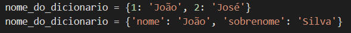
  <h6>Figura 13 – Declaração de dicionário com {}</h6>
</div>

<h2>8.2) Utilizando o método dict()</h2>
Essa forma se diferencia da anterior apenas pelo uso do método dict(), que deve englobar a declaração do dicionário.

<div align="center">
  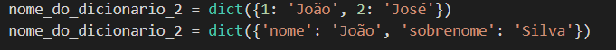
  <h6>Figura 14 – Declaração de dicionário com o método dict()</h6>
</div>

<h2>9) OPERAÇÕES COM DICIONÁRIOS</h2>
<h3>9.1) Retornando elementos pelo índice</h3>
Para retornar um elemento pelo seu índice, podemos utilizar os colchetes ([]) ou o método get(). Em ambos os casos, passamos a chave do elemento que desejamos recuperar. Vamos declarar o seguinte dicionário:

<div align="center">
  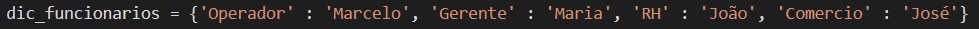
  <h6>Figura 15 – Dicionário de funcionários de uma empresa genérica</h6>
</div>

Podemos recuperar os nomes dos funcionários dessa empresa através dos seus cargos:
<div align='center'>
  <table>
    <tr>
      <td>print(dic_funcionarios[‘RH’])</td>
      <td>João</td>
    </tr>
    <tr>
      <td>print(dic_funcionarios.get(‘Gerente’))</td>
      <td>Maria</td>
    </tr>
  </table>
</div>

<h3>8.2) Tamanho de um dicionário</h3>
Assim como para várias estruturas que já vimos anteriormente, o método len() novamente aparece por aqui para nos passar o tamanho de um dicionário.
<div align='center'>
  <table>
    <tr>
      <td>print(len(dic_funcionarios))</td>
      <td>4</td>
  </table>
</div>

<h3>8.3) Adicionar elementos</h3>
Também existem duas formas. Na primeira, passamos o valor da nova chave e atribuímos um elemento a ela, da seguinte forma:
<div align='center'>
  <table>
    <tr>
      <td>dic_funcionarios[‘Financeiro’] = ‘Renata</td>
      <td> </td>
    </tr>
    <tr>
      <td>print(dic_funcionarios))</td>
      <td>{'Operador' : 'Marcelo', 'Gerente' : 'Maria', 'RH' : 'João', 'Comercio': 'José', ‘Financeiro’ : ‘Renata’}</td>
    </tr>
  </table>
</div>

A segunda forma é utilizando o método update(), passando como parâmetro a chave e o elemento a ser adicionado:
<div align='center'>
  <table>
    <tr>
      <td>dic_funcionarios.update({‘Publi’ : ‘Pedro’})</td>
      <td> </td>
    </tr>
    <tr>
      <td>print(dic_funcionarios))</td>
      <td>{'Operador' : 'Marcelo', 'Gerente' : 'Maria', 'RH' : 'João', 'Comercio' : 'José', ‘Financeiro’ : ‘Renata’, ‘Publi’ : ‘Pedro’}</td>
    </tr>
  </table>
</div>

<h3>8.4) Removendo elementos</h3>
Utilizamos o método pop() seguido da chave do elemento que deve ser removido.

<div align='center'>
  <table>
    <tr>
      <td>dic_funcionarios.pop(‘RH’)</td>
      <td> </td>
    </tr>
    <tr>
      <td>print(dic_funcionarios))</td>
      <td>{'Operador' : 'Marcelo', 'Gerente' : 'Maria', 'Comercio' : 'José', ‘Financeiro’ : ‘Renata’, ‘Publi’ : ‘Pedro’}</td>
    </tr>
  </table>
</div>

<h2>9) TUPLAS</h2>
As tuplas, apesar de raramente mencionadas, são muito utilizadas em diversas aplicações. Tuplas são como listas, se diferenciando por ter imutável. Isso quer dizer que, após definida, a tupla não permite a adição ou remoção de elementos.
Porém é um equívoco pensar nas tuplas como listas constantes, uma vez que listas são destinadas a serem sequência homogêneas, enquanto tuplas são estruturas heterogêneas (Eby, 2005).
O que Phillip J. Eby quer dizer é: quando pensamos em uma lista, pensamos em organizar coisas do mesmo tipo. Pensamos numa lista de filmes, de livros, de séries, de disciplinas, de professores... Já quando pensamos em tuplas, devemos pensar em elementos de tipos distintos. Por exemplo, podemos fazer uma tupla que salve a data de aniversário de alguém:

<div align="center">
  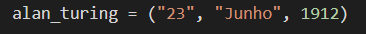
  <h6>Figura 16 – Tupla que contém dia, mês e ano</h6>
</div>

Daí estabelecemos outra diferença entre listas e tuplas: em uma lista, usamos colchetes para delimitar seus elementos, enquanto na tupla usamos os parênteses. Apesar disso, todos os outros métodos que estudamos sobre listas também se aplicam às tuplas, com exceção da adição e da remoção de elementos. Resumimos, então:

<li>Listas são delimitadas por colchetes, tuplas são delimitadas por parênteses;
<li>A ordem dos elementos de uma tupla não pode de alterada;
<li>Não é possível adicionar ou remover elementos de uma tupla já definida;
<li>A iteração, junção e a ideia de elementos como objetos são preservadas das listas para
as tuplas.

## FIXANDO O APRENDIZADO.
Já sente confiança para praticar? Faça a lista de exercícios clicando <a href="https://github.com/edjairaguiar/minicurso-python/blob/main/exercicios/lista2.md">aqui</a>.
