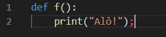
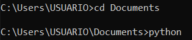
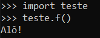
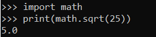

<h2>1) MÓDULOS</h2>

Módulos são arquivos de código Python com a extensão .py, que podem ser importados por
outros módulos.
A modularização de um programa é algo bastante importante por duas razões principais:
<li> É possível reutilizar o código escrito em outras aplicações;
<li> Estando o código do programa organizado, temos maior facilidade no controle e no
entendimento da aplicação;

Quando importamos um módulo para nosso código, as declarações do arquivo importado (suas
variáveis, suas funções e etc.) ficam disponíveis para serem usadas. É mais ou menos como a
importação de uma biblioteca na linguagem .C, por exemplo.

Nós chamamos um módulo no nosso programa utilizando a linha de comando

```$ import nomeDoMódulo```

A extensão .py deve ser omitida.

<h2>2) CRIANDO E ACESSANDO ATRIBUTOS DE MÓDULOS</h2>

Cada módulo tem suas próprias declarações de variáveis, funções, classes... cada uma delas carrega com si seu nome. Podemos acessar as variáveis e funções do módulo no nosso programa. Para isso, utilizamos a notação

```$ nomeDoMódulo.nomeDaFuncao```

EXEMPLO: Podemos abrir o editor de texto e escrever uma função simples como na Figura 1. Salvamos o nome do arquivo como teste.py.

<div align="center">
  
  <h6>Figura 1 – Código do módulo teste.py</h6>
</div>

[!] ATENÇÃO: Salve o arquivo do módulo em uma pasta fácil de acessar, pois antes de chamar o interpretador python precisaremos acessar a pasta pelo prompt de comando. Eu salvei na pasta Documentos. Dessa forma, primeiro acessei a pasta onde salvei o arquivo e só então chamei o interpretador python, como visto na Figura 2.

<div align="center">
  
  <h6>Figura 2 – Precisamos acessar a pasta onde o arquivo foi salvo antes de chamar o python</h6>
</div>

Agora que salvamos nosso módulo, vamos chamá-lo para nosso programa, escrevendo ```import teste```. Logo em seguida, chamamos nossa função f digitando ```teste.f()```. O resultado podemos ver na Figura 3.

<div align="center">
  
  <h6>Figura 3– Chamamos a função f() através do módulo teste.py</h6>
</div>

<h2>3) MÓDULOS PADRÕES</h2>
O Python traz uma biblioteca padrão de módulos, embutidas no interpretador da linguagem. Esses módulos permitem o acesso a algumas operações que não fazem parte do núcleo da linguagem, mas estão no interpretador por eficiência.

Por exemplo: funções matemáticas não estão tradicionalmente inclusas no escopo de funções de entrada e saída da linguagem. Nesse caso, temos duas opções: implementá-las manualmente; ou importar o módulo math, que disponibiliza grande parte das funções matemáticas que conhecemos na calculadora científica.


<div align="center">
  <table>
    <tr>
    <td>math.exp(x)</td>
    <td>𝑒𝑥</td>
    </tr>
    <tr>
    <td>math.log10(x)</td>
    <td>Logaritmo do parâmetro x na base 10</td>  
    </tr>
    <tr>
    <td>math.pow(x, y)</td>
    <td>𝑥^𝑦</td>  
    </tr>
    <tr>
    <td>math.sqrt(x</td>
    <td>√𝑥</td>  
    </tr>
    <tr>
    <td>math.degrees(x)</td>
    <td>Converte x radianos para graus</td> 
    </tr>
    <tr>
    <td>math.radians(x)</td>
    <td>Converte x graus para radianos</td>
    </tr>
  </table>
  <h6>Tabela 1 – Algumas funções do módulo math</h6>
</div>

Na Figura 4 temos um exemplo da utilização do módulo math, utilizando a função ```math.sqrt()```.

<div align="center">
  
  <h6>Figura 4 – Cálculo de raiz quadrada com função math.sqrt</h6>
</div>

<h2>4) OBSERVAÇÕES</h2>
<li>O editor de texto usado é o Visual Studio Code. Entretanto é possível utilizar qualquer outro editor de texto, desde que a extensão do arquivo seja salva como .py. Outro editores de texto que podem ser usados: WordPad, Notepad++.
<li>A importação de módulos é custosa computacionalmente, portanto o Python só a realiza uma vez. Caso editemos o módulo durante a execução do nosso código e precisemos que a edição seja utilizada, podemos forçar que o módulo seja importado novamente usando o comando reload(nomeDoMódulo).
