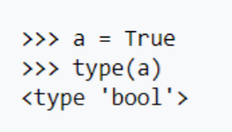
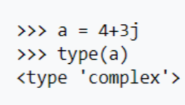

# VARIÁVEIS

A parte interessante do Python é que essa é uma linguagem de tipos dinâmicos: ou seja, a
declaração de tipo da variável não precisa ser feita. A própria linguagem é capaz de escolher que tipo usar para cada variável, podendo alterá-lo durante a execução do programa. Segue um exemplo dessa característica:
```python
# atribuição de valor ax
>>> x = 'Oi'
# exibição do valor e tipo da variável
>>> print(f'{x} ->', type(x))
Oi -> <class 'str'>

>>> x = 1.2
>>> print(f'{x} ->', type(x))
1.2 -> <class 'float'>
```

Pra cada tipo que a variável assume, a linguagem impõe restrições associadas. Seguem, por exemplo, os tipos numéricos:
- Inteiro (int);
- Ponto flutuante (float);
- Booleano (bool);
- Complexo (complex);

Todos esses tipos suportam as operações algébricas comuns (adição, subtração, multiplicação e divisão) e também podem se relacionar. As figuras abaixo mostram alguns exemplos do funcionamento de tipos em Python:
<div style="display: inline_block" align="center">
  
  
  
  
</div>

Logo, caso haja a tentativa de realizar alguma operação tida como inválida sobre uma variável, um erro será lançado, a exemplo
```python
>>> x="a"
>>> y="b"
>>> x*y
Traceback (most recent call last):
  File "<stdin>", line 1, in <module>
TypeError: can't multiply sequence by non-int of type 'str'
```

O python possui também tipos e estruturas de dados mais complexas e é importante explorá-las, como [`tuple`, `dict`, `list`](https://docs.python.org/3.8/library/stdtypes.html#sequence-types-list-tuple-range).

## FIXANDO O APRENDIZADO.
Já sente confiança para praticar? Faça a lista de exercícios clicando <a href="https://github.com/edjairaguiar/minicurso-python/blob/main/exercicios/lista1.md">aqui</a>.
