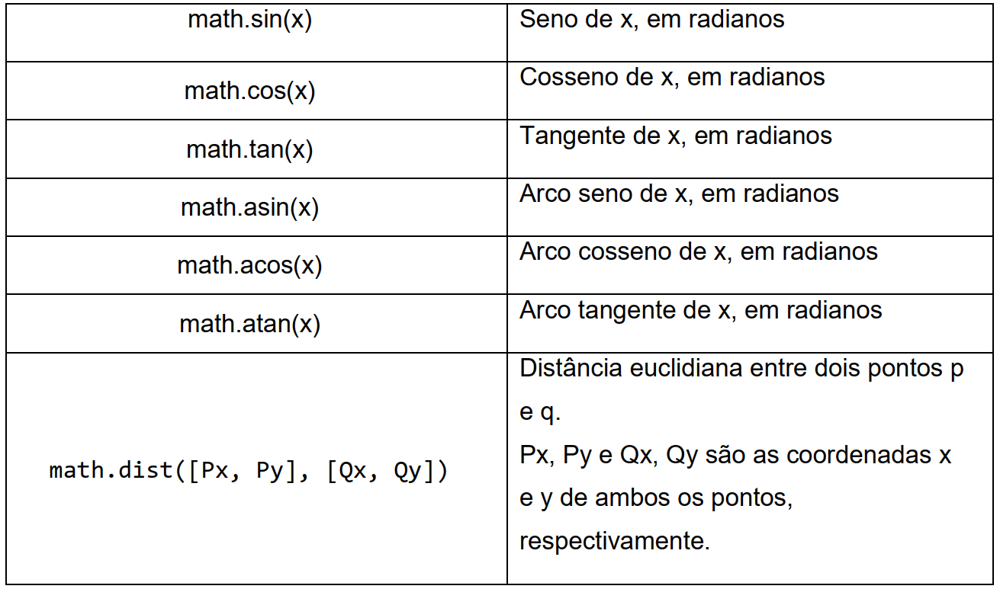
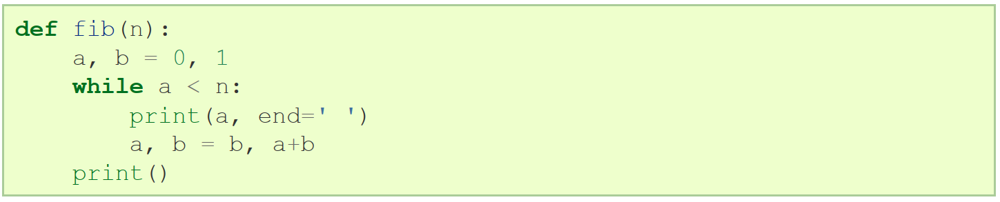
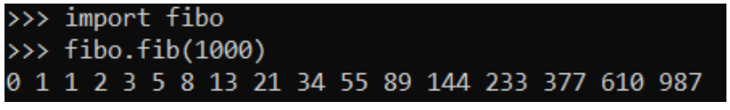

# LISTA DE EXERCÍCIOS 2

1. A tabela abaixo mostra todas as funções trigonométricas que são disponibilizadas pelo
módulo padrão math. Importe esse módulo e teste essas funções a seu agrado. <i>Dica: Essas funções utilizam valores em radianos. Você pode brincar com a conversão de
valores entre radianos e graus utilizando as funções citadas na aula!</i>

 

  

2. A função abaixo nos retorna a soma da série de Fibonacci que mais se aproxima no
valor n que passamos como parâmetro.

 

  

Por exemplo: se chamarmos a função com o valor 1000, os números retornados serão 0, 1, 1, 2, 3, 5, 8, 13, 21, 24, 34, 55, 89, 144, 233, 377, 610, 987.

 

  

<u>Copie o código da função fib e salve num arquivo .py chamado fibo.</u> Em seguida, importe o arquivo fibo.py como módulo (lembrando que a importação de módulo omite a extensão .py) e teste a função fib para os valores de n que você achar melhor! O intuito do exercício é mostrar como a importação de módulos facilita a definição de funções e melhor distribuição de um programa em pequenos arquivos.
